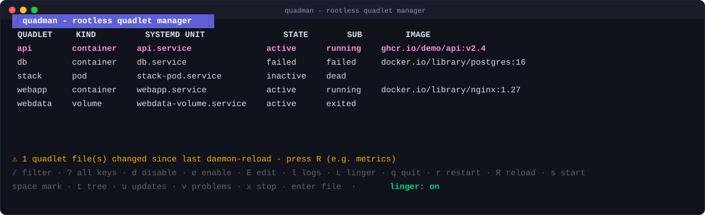
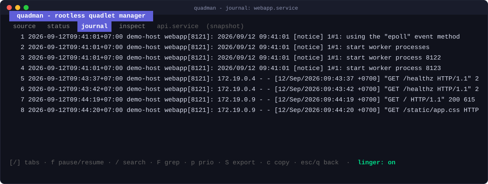
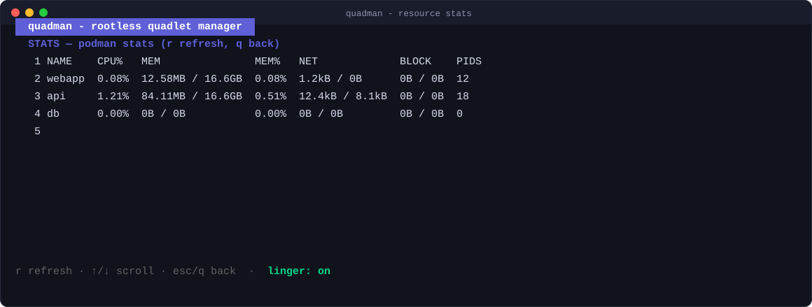

<div align="center">

# quadman

**Terminal UI manager untuk unit rootless Podman [Quadlet](https://docs.podman.io/en/latest/markdown/podman-systemd.unit.5.html).**

<p align="center">
  <a href="README.md"><b>English</b></a> | <a href="README.id.md"><b>Bahasa Indonesia</b></a>
</p>

[](https://github.com/fahmikemal/quadman/actions/workflows/ci.yml)
[](https://github.com/fahmikemal/quadman/releases)
[](https://pkg.go.dev/github.com/fahmikemal/quadman)
[](https://goreportcard.com/report/github.com/fahmikemal/quadman)
[](LICENSE)

</div>

Quadlet adalah standar yang direkomendasikan untuk menjalankan container rootless sebagai systemd service — namun perkakas bawaannya tersebar di antara `systemctl`, `journalctl`, dan `loginctl`. quadman menyatukan seluruh siklus hidup tersebut dalam satu TUI terpadu:

- Mendeteksi setiap berkas sumber Quadlet yang dibaca oleh generator systemd (`*.container`, `*.pod`, `*.kube`, `*.volume`, `*.network`, `*.image`, `*.build`, `*.artifact`), di seluruh hierarki direktori pencarian pengguna (`$XDG_RUNTIME_DIR/containers/systemd` → `~/.config/containers/systemd` → `/etc/containers/systemd/users[/UID]` → `/usr/share/containers/systemd/users[/UID]`), dengan mekanisme shadowing (*first-match*) yang identik dengan generator resmi Podman.
- Memetakan setiap berkas sumber ke unit systemd yang dihasilkan oleh generator (`webapp.container` → `webapp.service`, `stack.pod` → `stack-pod.service`, `cache.volume` → `cache-volume.service`, dst.), menghargai override `ServiceName=` dan template unit (`web@.container` → `web@.service`).
- Menampilkan status live secara real-time (active/inactive/failed, `not-found` saat Anda lupa melakukan `daemon-reload`) beserta image yang dikonfigurasi langsung di tabel utama — di-refresh secara otomatis setiap beberapa detik dengan posisi kursor tetap terkunci pada baris pilihan Anda.
- Operasi `start` / `stop` (dengan konfirmasi aman — Quadlet menjalankan container dengan opsi `--rm`) / `restart` / `enable` / `disable` / `daemon-reload` cukup dengan satu tombol cepat, masing-masing disertai indikator animasi spinner saat operasi berjalan.
- Memberikan peringatan (*warning banner*) jika berkas quadlet mengalami modifikasi setelah `daemon-reload` terakhir, sehingga Anda tidak lagi bingung mengapa perubahan konfigurasi belum aktif.
- **Follow-mode journals** — streaming live `journalctl -f` per unit dengan fitur auto-scroll ke baris terbawah (*stick-to-tail*), jeda streaming (`f`), live grep filter (`F`), filter prioritas log (`p`), ekspor ke `.log`/`.jsonl` (`S`), dan salin log ke clipboard via OSC52 (`c`).
- **Command Palette** (`Ctrl+P`) — modal overlay berbasis pencarian fuzzy untuk menemukan dan mengeksekusi semua aksi siklus hidup unit, navigasi layar/view, diagnostik, dan perintah kustom (*custom commands*) dengan validasi status kontekstual secara langsung.
- **Native Wish SSH Daemon** (`quadman serve`) menyajikan antarmuka TUI langsung melalui protokol SSH tanpa perlu menginstal quadman di mesin klien penghubung: bind loopback saja secara default, `authorized_keys` wajib untuk bind non-loopback, lengkap dengan autentikasi public key, autentikasi password, pembuatan host key otomatis, dan mode dashboard *read-only*.
- **Mode Ganda Rootless & Sistem** (`--system`) — identitas utama tetap memprioritaskan rootless secara bawaan, namun mendukung penuh manajemen unit tingkat sistem (*rootful*) (`/etc/containers/systemd`, `/run/containers/systemd`) serta deteksi otomatis hak akses root (`sudo quadman`).
- Pencarian fuzzy `/` untuk memfilter daftar unit secara instan saat Anda mengetik.
- Mengedit berkas quadlet langsung di editor teks `$EDITOR` bawaan Anda dari dalam TUI; otomatis memberikan peringatan untuk me-reload generator setelah berkas disimpan.
- **Layar auto-update** (`u`) — preview `podman auto-update --dry-run` dan status timer `podman-auto-update.timer`, dapat diaktifkan/dinonaktifkan langsung dengan `U`.
- Pemantauan kesehatan container (*healthcheck*): container yang tidak sehat (*unhealthy*) langsung ditandai di kolom STATE, dan tombol `h` mengeksekusi `podman healthcheck run` pada unit yang dipilih.
- **Validasi bawaan (*built-in validation*)** — generator Quadlet resmi dijalankan secara *dry-run* untuk memvalidasi setiap berkas saat refresh; unit yang bermasalah ditandai dengan ✗/⚠ dan layar `v` menjelaskan detail error secara gamblang, termasuk deteksi versi Podman (*version-gating hints*).
- **Direktori Drop-in** — mendukung berkas konfigurasi tambahan `foo.container.d/*.conf` (termasuk *cascading* `foo-.container.d/` dan drop-in generik `container.d/`) yang ditampilkan menyatu (*merged*) sesuai urutan evaluasi generator systemd.
- **Pohon dependensi (*dependency tree*)** (`t`) — visualisasi relasi pods → containers → unit image/network/volume beserta dependensi direktif `[Unit]`, dirender dengan komponen pohon (*tree*).
- Dukungan mouse: klik baris untuk memilih, putar roda mouse untuk menggulir log; `y`/`Y` untuk menyalin nama unit/image ke clipboard via protokol OSC52 (berfungsi mulus bahkan melalui koneksi SSH).
- **Panel detail bertab** (`[`/`]`) — menampilkan kode sumber, `systemctl status`, live journal, dan `podman inspect` dari unit yang dipilih dalam satu tampilan terintegrasi.
- **Penyimpanan & Event** — tombol `g` untuk diagnosa disk `podman system df --verbose`, tombol `w` untuk live streaming `podman events` (dapat dijeda dengan `f`).
- **Petunjuk pintar (*smart hints*)** — jika start unit berstatus `timed-out`, TUI menyarankan penyesuaian `TimeoutStartSec=` atau `Pull=`; peringatan *crash-loop* dan pemakaian `AutoUpdate=` tanpa timer aktif juga langsung disorot pada layar diagnostik masalah.
- **Generator dari perintah apapun** (`n`) — salin-tempel perintah `docker run` atau jalur berkas docker-compose; utilitas [podlet](https://github.com/containers/podlet) akan mengonversinya, Anda dapat meninjau preview hasilnya, lalu tekan `y` untuk menulis berkas dan memicu reload generator secara otomatis.
- **Template & Bundel** — instansiasi template `web@.container` menjadi `web@prod.service` (`i`), serta preview dan instalasi bundel multi-dokumen `.quadlets` (`I`).
- Pengayaan data opsional melalui `podman quadlet list` (pengelompokan aplikasi/pod) jika binary podman terpasang di host; tetap berfungsi penuh 100% tanpa ketergantungan podman socket.
- **Indikator & Pengontrol Linger Pengguna** — `loginctl enable-linger` adalah satu konfigurasi krusial yang wajib dimiliki server container rootless (tanpa linger, container Anda akan mati saat user logout). quadman menampilkan status linger di bar navigasi bawah dan memungkinkan toggle status dengan satu tombol `L`.

quadman dirancang secara sengaja bersifat *engine-agnostic*: hanya memanggil CLI `systemctl --user` / `journalctl --user` / `loginctl`, sehingga kompatibel dengan semua instalasi Podman rootless dan sama sekali tidak membutuhkan daemon atau socket API Podman yang berjalan di latar belakang.

## Tangkapan Layar (Screenshots)

Tampilan tabel utama — seluruh sumber Quadlet, unit systemd terkait, status aktif, dan image kontainer, lengkap dengan banner peringatan jika berkas di disk berubah:



Memilih unit akan langsung melakukan streaming journal secara real-time (`journalctl -f`) tanpa perlu keluar dari antarmuka TUI — jeda dengan `f`, cari dengan `/`:



Penggunaan resource per kontainer (`podman stats`), hanya sejauh satu tombol:



## Instalasi

Unduh binary siap pakai (Linux amd64/arm64) dari halaman [Releases](https://github.com/fahmikemal/quadman/releases):

```sh
curl -LO https://github.com/fahmikemal/quadman/releases/latest/download/quadman_0.6.0_linux_amd64.tar.gz
tar -xzf quadman_0.6.0_linux_amd64.tar.gz && sudo install quadman /usr/local/bin/
```

Atau menggunakan Go:

```sh
go install github.com/fahmikemal/quadman@latest
```

Atau kompilasi langsung dari repositori:

```sh
make build   # ./quadman
```

Kebutuhan sistem: Linux dengan systemd, sesi pengguna (*user session* untuk mode rootless), dan `journalctl` untuk penampil log. Tanpa daemon latar belakang; mendukung satu berkas konfigurasi YAML opsional (lihat bagian Konfigurasi di bawah).

## Penggunaan

```sh
quadman                          # Buka antarmuka TUI (sesi user rootless secara default)
quadman --system                 # Mode tingkat sistem / rootful (/etc/containers/systemd)
sudo quadman                     # Deteksi otomatis root dan mengaktifkan mode sistem
quadman serve                    # Jalankan TUI sebagai SSH server via Wish daemon (default 127.0.0.1:2222)
quadman serve -p 2222 --readonly # Dashboard monitoring SSH mode baca-saja
quadman --readonly               # TUI dengan seluruh aksi pengubah status dinonaktifkan
quadman --ssh user@host          # Kelola server remote rootless melalui koneksi SSH
quadman --theme colorblind       # Pilihan tema: auto, dark, light, atau colorblind
quadman --mouse                  # Aktifkan navigasi klik mouse
quadman --quadlet-dir ~/quadlets # Direktori sumber Quadlet tambahan (dapat diulang)
quadman list                     # Output daftar non-interaktif untuk integrasi script/piping
quadman --system list            # Tampilkan daftar quadlet tingkat sistem (flag ditulis sebelum perintah)
quadman --as svc-web list        # Daftar unit milik user lain via sudo (flag ditulis sebelum perintah)
quadman --skill                  # Ekspor spesifikasi Agent Skill untuk AI (markdown)
quadman --skill --skill-format=json # Ekspor spesifikasi Agent Skill dalam format JSON
quadman -version
```

### Tombol Navigasi (Keybindings)

| Tombol | Aksi |
| ----- | --------------------------------------------- |
| `↑/↓` `j/k` | Berpindah navigasi pada daftar baris |
| `enter` | Melihat isi berkas sumber Quadlet |
| `Ctrl+P` | Command Palette (pencarian fuzzy dan eksekusi aksi unit, termasuk pull image, atau perintah kustom) |
| `/` | Filter fuzzy daftar unit (ketik untuk menyaring, `esc` untuk menghapus filter) |
| `l` | Live journal tail (`f` jeda, `/` cari, `F` grep filter, `p` prioritas, `S` ekspor, `c` salin) |
| `s` / `x` / `r` | Start / stop (dengan konfirmasi) / restart unit — atau seluruh unit yang ditandai dengan `space` |
| `space` | Tandai/lepas tanda baris untuk aksi massal (*bulk actions*, `esc` untuk membersihkan tanda) |
| `e` | Aktifkan saat boot (*enable*, menyisipkan blok `[Install]` ke berkas dengan konfirmasi) |
| `d` | Nonaktifkan saat boot (*disable*, menghapus blok `[Install]` dengan konfirmasi) |
| `E` | Mengedit berkas Quadlet menggunakan `$EDITOR` |
| `X` | Buka `/bin/sh` di kontainer unit (`podman exec`, pencocokan nama persis) |
| `u` | Layar auto-update (`U` untuk toggle status timer otomatis) |
| `h` | Menjalankan `podman healthcheck` pada unit yang dipilih |
| `v` | Layar diagnosa masalah — validasi generator terhadap seluruh berkas Quadlet |
| `t` | Pohon dependensi (*dependency tree*: pods, images, networks, volumes, dependensi `[Unit]`) |
| `i` | Instansiasi template unit (`web@.container` → `web@prod.service`) |
| `D` | Hapus unit (menghentikan kontainer dan menghapus berkas sumber dengan konfirmasi) |
| `y` / `Y` | Salin nama unit / image ke clipboard (OSC52, bekerja sempurna via SSH) |
| `[` / `]` | Berpindah tab detail: source / status / journal / inspect |
| `I` | Pasang bundel `.quadlets` (`podman quadlet install`) |
| `g` | Layar penyimpanan (*storage*: `podman system df --verbose`, `r` untuk refresh) |
| `o` | Layar statistik resource (`podman stats`, `r` untuk refresh) |
| `P` | `podman system prune` (konfirmasi dulu, peringatan untuk unit Quadlet nonaktif) |
| `T` | Layar timer systemd (melihat jadwal aktif, pemicu service, dan hitung mundur kalender) |
| `K` | Layar secret Podman (melihat penyimpanan secret Podman, driver, dan metadata) |
| `w` | Live streaming event podman (`f` untuk jeda) |
| `n` | Generator quadlet via podlet (`podman run ...`, `docker run ...`, singkatan `run ...`, `compose <path>`, atau `<kind> <name>` untuk container\|pod\|network\|volume\|image) |
| `A` | Log aksi terakhir (melihat perintah apa yang dijalankan, waktu, dan hasilnya) |
| `R` | `systemctl --user daemon-reload` (regenerasi unit setelah berkas Quadlet diedit) |
| `L` | Toggle linger pengguna (`loginctl enable-linger`) |
| `?` | Buka bantuan tombol (*help overlay*) |
| `q` / `esc` | Keluar / kembali ke layar sebelumnya |

## Konfigurasi

Pengaturan YAML opsional terletak di `~/.config/quadman/config.yaml` (seluruh opsi bersifat opsional; berkas yang korup/salah sintaks akan dilaporkan di bar status bawah dan tidak diabaikan secara diam-diam):

```yaml
refresh_interval: 5s   # Interval polling daftar (default 2.5s)
log_tail: 200          # Jumlah baris awal snapshot journal saat membuka log
log_buffer: 1000       # Batas maksimum baris buffer penampil log
readonly: false        # Sama dengan flag quadman --readonly
theme: auto            # auto, dark, light, atau colorblind
mouse: false           # Sama dengan flag quadman --mouse (off menjaga seleksi teks terminal tetap aktif)
quadlet_dirs:          # Direktori sumber Quadlet tambahan (sama dengan --quadlet-dir)
  - ~/quadlets
serve:
  authorized_keys: ~/.ssh/authorized_keys # wajib untuk bind non-loopback
  # address: 127.0.0.1:2222 # default; 0.0.0.0:2222 untuk LAN (butuh authorized_keys)
  # password_file: /run/secrets/quadman-pass # atau password: ... (salah satu saja)
  # readonly: false # sajikan sesi read-only

custom_commands:
  - name: status
    key: S
    run: systemctl --user status {{.UnitName}}
  - name: image
    key: G
    run: podman image inspect {{.Image}}
```

Tombol kustom tidak boleh memakai tombol bawaan mode daftar (`s x r e d E u h v t i I D y Y g o P T K w n A R L ? q l X` dan sejenisnya):
quadman memberi peringatan saat startup bila ada perintah kustom yang tertutup (*shadowed*) karena tombol bawaan selalu menang.

Perintah kustom (*custom commands*) dijalankan secara aman tanpa perantara shell: string `run` diekspansi sebagai template Go (`{{.Name}}`, `{{.UnitName}}`, `{{.Kind}}`, `{{.Image}}`), dipecah dengan tokenizer pemisah tanda kutip, dan dieksekusi langsung. Hasil eksekusi tampil di bar status bawah dan tercatat di log aksi terakhir (`A`). Preferensi editor teks saat pertama kali dipilih disimpan pada berkas `config.json` di direktori yang sama.

## Mode SSH Remote

```sh
quadman --ssh user@host
```

Setiap pemanggilan CLI (`systemctl`, `journalctl`, `loginctl`, `podman`) diteruskan melalui binary `ssh` lokal Anda — SSH key, ssh-agent, `known_hosts`, dan konfigurasi `~/.ssh/config` langsung bekerja otomatis tanpa perlu setup tambahan. Jika `ssh user@host true` berhasil, quadman dipastikan langsung bekerja.

Mode remote mempertahankan kendali penuh untuk operasi baca dan siklus hidup: daftar unit, status live, start / stop / restart, journal logs, storage, stats, events, auto-update, healthcheck, linger, dan pohon dependensi (berkas dibaca via `cat` sesuai kebutuhan, tanpa sinkronisasi disk). Aksi yang memodifikasi berkas di host (seperti edit, enable/disable saat boot, instansiasi template, generate berkas, install bundel, dan delete) dibatasi dengan pesan penjelasan — kelola berkas secara langsung dengan menjalankan quadman di server target. Aksi interaktif/destruktif host juga ditolak dari remote: `podman exec` (`X`) butuh TTY lokal dan `system prune` (`P`) harus dijalankan di host. Drop-in dienumerasi dari remote (read-only) dan digabung di layar berkas.

## Kompartemen (banyak OS user, satu TUI)

Kompartemen adalah OS user biasa yang workload Quadlet-nya Anda kelola tanpa
keluar dari quadman. `quadman --as svc-web` mengarahkan seluruh pemanggilan
CLI (`systemctl`, `journalctl`, `loginctl`, `podman`) melalui sudo
non-interaktif (`sudo -n -u svc-web`), terlingkup ke search path Quadlet,
systemd user instance, storage podman, dan secret store milik user tersebut.
Title bar menampilkan `[svc-web]`; edit berkas tetap dinonaktifkan seperti
mode SSH.

Syarat: `sudo -n -u <user> true` harus berhasil (entri sudoers NOPASSWD atau
operator root), dan target butuh runtime dir (`/run/user/<uid>` — linger
user tersebut atau login sekali). Bila salah satunya hilang, quadman
menjelaskan sebabnya dan tetap menampilkan sesi Anda sendiri, bukan
setengah beralih.

Kompartemen yang dikonfigurasi (`compartments: [svc-web, svc-db]` di
config.yaml) muncul di Command Palette (`Ctrl+P`) sebagai aksi
"Use Compartment ...", plus "Use Own Session" untuk kembali. Berpindah
kompartemen di atas sesi SSH ditolak (tanpa sudo hop bersarang), dan
`--system` tidak bisa digabung dengan `--as` sama sekali (unit sistem
berada di luar sesi user mana pun).
Script non-interaktif memakai `quadman --as <user> list`.

```yaml
compartments:
  - svc-web
  - svc-db
```

## SSH Server (Wish Daemon)

```sh
quadman serve                                          # Berjalan di 127.0.0.1:2222 (loopback saja)
quadman serve -p 2222 --readonly                       # Dashboard pemantauan read-only via SSH (loopback)
quadman serve -a 0.0.0.0:2222 --authorized-keys ~/.ssh/authorized_keys # Akses LAN, kunci wajib
quadman serve --password rahasia123                    # Proteksi kata sandi (loopback saja)
quadman serve --password-file /run/secrets/quadman-pass # Kata sandi dari berkas, aman dari process list (loopback saja)
quadman --as svc-web serve --readonly                  # Sajikan sesi milik user lain via kompartemen sudo
```

quadman menyertakan server SSH bawaan yang ditenagai oleh pustaka [Charm Wish](https://github.com/charmbracelet/wish) (`wish/v2`). Secara default server hanya bind loopback. Untuk berbagi ke tim di LAN, bind eksplisit dengan autentikasi public-key, karena bind non-loopback menolak berjalan tanpa `--authorized-keys`:

```sh
quadman serve -a 0.0.0.0:2222 --authorized-keys ~/.ssh/authorized_keys
ssh -p 2222 user@host
```

Fitur utama SSH Server:
- **Nol dependensi klien**: Komputer yang menghubung hanya memerlukan terminal client standar `ssh`.
- **Host Key Otomatis**: Membuat kunci host ED25519 otomatis di `~/.config/quadman/host_ed25519` jika belum ditentukan.
- **Opsi Autentikasi**: Mendukung verifikasi berkas `authorized_keys` atau perlindungan kata sandi (loopback saja). Kata sandi berasal dari tepat satu sumber: `--password`, `--password-file`, `QUADMAN_SERVE_PASSWORD`, atau config `password`/`password_file`; pilih bentuk berkas atau env agar secret tidak muncul di process list. Tanpa keduanya di loopback, server tetap berjalan tetapi **memaksa semua sesi ke mode readonly** dengan peringatan jelas, dan akses tulis anonim tidak pernah aktif secara default, dan bind open-auth/password-only tidak pernah listen di luar loopback.
- **Mode Dashboard Readonly**: Tambahkan flag `--readonly` untuk membagikan akses pemantauan kepada rekan tim dengan aman tanpa risiko salah mematikan atau mengubah unit produksi.
- **Eksekusi Aman**: Pembukaan editor lokal `$EDITOR` dinonaktifkan secara aman pada sesi server SSH.

## Lokasi Berkas Quadlet

quadman memindai hierarki pencarian rootless generator resmi:
(`$XDG_RUNTIME_DIR/containers/systemd` → `~/.config/containers/systemd` → `/etc/containers/systemd/users[/UID]` → `/usr/share/containers/systemd/users[/UID]`),
ditambah direktori kustom Anda dari opsi `quadlet_dirs` di config.yaml atau flag berulang `--quadlet-dir` (misal repositori git yang berisi manifest infrastruktur Anda). Direktori tambahan ditempatkan setelah direktori standar, sehingga berkas bernama sama di direktori standar tetap mengutamakan *shadowing* — semantik generator tetap terjaga.

Unit yang hanya ada di direktori tambahan ditandai dengan simbol `~`: generator belum dapat memuatnya, sehingga upaya menyalakan unit tersebut akan ditolak dengan penjelasan hingga berkas tersebut disalin atau di-symlink ke direktori pencarian standar dan di-reload (`R`). Aturan ini berlaku konsisten baik pada antarmuka TUI maupun perintah non-interaktif `quadman list`.

## Kompatibilitas

quadman dirancang khusus untuk ekosistem **Podman 6.x** (terbaru: 6.1.1, Sep 2026) dan kompatibel penuh mulai dari Podman 5.3+, rilis yang pertama kali memperkenalkan sub-perintah `podman quadlet list`. Seluruh komponen pustaka terminal menggunakan versi mutakhir: bubbletea v2.0.10, bubbles v2.2.1, dan lipgloss v2.0.6.

## Peta Jalan quadman

Moved to [ROADMAP.id.md](ROADMAP.id.md).

## Proyek Terkait

- [podman-tui](https://github.com/containers/podman-tui) — TUI resmi untuk Podman runtime (containers, pods, images). quadman melengkapinya di lapisan pengelolaan systemd/Quadlet.
- [podlet](https://github.com/k9withabone/podlet) — Generator CLI untuk berkas Quadlet.
- [quadletman](https://github.com/mikkovihonen/quadletman) — Web UI untuk manajemen Quadlet.

Tidak terafiliasi secara resmi dengan proyek Podman upstream.

## Keamanan

Lihat [SECURITY.id.md](SECURITY.id.md) untuk versi yang didukung, cara
melaporkan kerentanan, dan default hardening yang sudah tersedia.

## Lisensi

[MIT](LICENSE)
