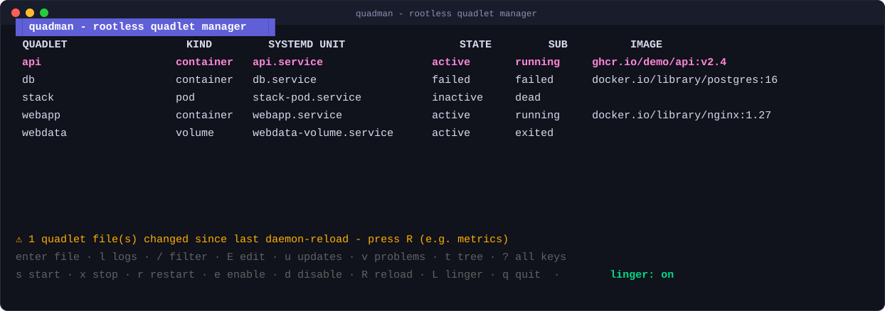
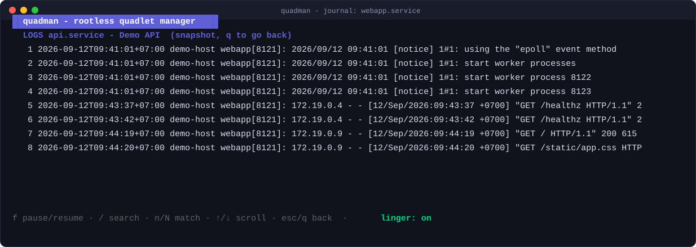

<div align="center">

# quadman

**A terminal UI manager for rootless Podman [Quadlet](https://docs.podman.io/en/latest/markdown/podman-systemd.unit.5.html) units.**

<p align="center">
  <a href="README.md"><b>English</b></a> | <a href="README.id.md"><b>Bahasa Indonesia</b></a>
</p>

[](https://github.com/fahmikemal/quadman/actions/workflows/ci.yml)
[](https://github.com/fahmikemal/quadman/releases)
[](https://pkg.go.dev/github.com/fahmikemal/quadman)
[](https://goreportcard.com/report/github.com/fahmikemal/quadman)
[](LICENSE)

</div>

Quadlet is the recommended way to run rootless containers as systemd services — but its
tooling is scattered across `systemctl`, `journalctl`, and `loginctl`. quadman puts the
whole lifecycle in one TUI:

- Lists every Quadlet source file systemd's generator picks up (`*.container`, `*.pod`,
  `*.kube`, `*.volume`, `*.network`, `*.image`, `*.build`, `*.artifact`), across the
  generator's user search path (`$XDG_RUNTIME_DIR/containers/systemd` →
  `~/.config/containers/systemd` → `/etc/containers/systemd/users[/UID]` →
  `/usr/share/containers/systemd/users[/UID]`), with first-match shadowing like the
  generator.
- Maps each source file to the systemd unit the generator produces
  (`webapp.container` → `webapp.service`, `stack.pod` → `stack-pod.service`,
  `cache.volume` → `cache-volume.service`, …), honoring `ServiceName=` overrides
  and template units (`web@.container` → `web@.service`).
- Shows live state (active/inactive/failed, `not-found` when you forgot
  `daemon-reload`) and the configured image, right in the list — refreshed
  automatically every few seconds with the cursor pinned on your selection.
- `start` / `stop` (with confirmation — Quadlet runs containers `--rm`) /
  `restart` / `enable` / `disable` / `daemon-reload` with one keypress, each
  with a spinner while it runs.
- Warns when quadlet files changed after the last `daemon-reload`, so you
  never wonder why your edits do nothing.
- **Follow-mode journals** — live `journalctl -f` tail per unit with
  stick-to-tail scrolling, pause (`f`), live grep filter (`F`), priority filter (`p`), export to `.log`/`.jsonl` (`S`), and OSC52 clipboard copy (`c`).
- **Command Palette** (`Ctrl+P`) — fuzzy-search and execute all unit lifecycle actions, screens, views, diagnostics, and user custom commands with live context-sensitive validation.
- **Native Wish SSH Daemon** (`quadman serve`) — serve the TUI directly over SSH without installing quadman on the connecting machine, with public key auth (`authorized_keys`), password auth, host key generation, and readonly mode.
- **Dual Rootless / System Mode** (`--system`) — default rootless-first identity, with native rootful system support (`/etc/containers/systemd`, `/run/containers/systemd`) and automatic root detection (`sudo quadman`).
- `/` fuzzy-filter the unit list as you type.
- Edit quadlet files in `$EDITOR` from the TUI; get nudged to regenerate
  when the file changed.
- **Auto-update screen** (`u`) — `podman auto-update --dry-run` preview and
  the `podman-auto-update.timer` state, toggleable with `U`.
- Container health: unhealthy containers surface in the STATE column, `h`
  runs `podman healthcheck run` on the selected unit.
- **Built-in validation** — the Quadlet generator itself (dry-run) checks
  every file on refresh; units with problems get a ✗/⚠ marker and the `v`
  view explains each error, including version-gate hints for new keys.
- **Drop-in directories** — `foo.container.d/*.conf` (plus cascading
  `foo-.container.d/` and generic `container.d/`) shown merged in the file
  view, in the generator's merge order.
- **Dependency tree** (`t`) — pods → containers → image/network/volume
  units and `[Unit]` dependencies, rendered with the bubbles tree.
- Mouse: click a row to select it, wheel-scroll logs; `y`/`Y` copy names
  and images via OSC52 (works over SSH).
- **Tabbed detail pane** (`[`/`]`) — source, `systemctl status`, live journal,
  and `podman inspect` of the selected unit in one view.
- **Storage & events** — `g` for `podman system df --verbose`, `w` for a
  live `podman events` stream (pause with `f`).
- **Smart hints** — `timed-out` starts suggest `TimeoutStartSec=`/`Pull=`;
  crash-loops and `AutoUpdate=`-without-timer also get called out in the
  problems view.
- **Generate from anything** (`n`) — paste a `docker run` command or a
  compose file path; [podlet](https://github.com/containers/podlet) converts
  it, you preview the result, `y` writes it and reloads the generator.
- **Templates & bundles** — instantiate `web@.container` as
  `web@prod.service` (`i`), and preview/install multi-document `.quadlets`
  bundles (`I`).
- Optional enrichment via `podman quadlet list` (application/pod grouping)
  when podman is installed; fully functional without it.
- **Linger indicator and toggle** — `loginctl enable-linger` is the one setting every
  rootless container host needs (without it, your containers die at logout). quadman
  shows it in the status bar and toggles it with `L`.

quadman is engine-agnostic on purpose: it only drives the `systemctl --user` /
`journalctl --user` / `loginctl` CLIs, so it works with any Podman rootless setup and
never needs the Podman socket or API.

## Screenshots

The main list — every Quadlet source, its systemd unit, live state, and image,
with a `daemon-reload` warning when files changed on disk:



Selecting a unit streams its journal live (`journalctl -f`) without leaving
the TUI — pause with `f`, search with `/`:



## Install

Download a prebuilt binary (Linux amd64/arm64) from the
[Releases](https://github.com/fahmikemal/quadman/releases) page:

```sh
curl -LO https://github.com/fahmikemal/quadman/releases/latest/download/quadman_0.4.4_linux_amd64.tar.gz
tar -xzf quadman_0.4.4_linux_amd64.tar.gz && sudo install quadman /usr/local/bin/
```

Or with Go:

```sh
go install github.com/fahmikemal/quadman@latest
```

Or build from a clone:

```sh
make build   # ./quadman
```

Requirements: Linux with systemd, a user session (rootless-first by design), and
`journalctl` for log view. No daemon; one optional YAML settings file (see
Config below).

## Usage

```sh
quadman                          # TUI (rootless user session by default)
quadman --system                 # native system-wide (rootful) mode (/etc/containers/systemd)
sudo quadman                     # auto-detects root and activates system mode
quadman serve                    # serve TUI over SSH via Wish daemon (default :2222)
quadman serve -p 2222 --readonly # serve as a read-only monitoring dashboard over SSH
quadman --readonly               # TUI with all state-changing actions disabled
quadman --ssh user@host          # manage a remote rootless host over SSH
quadman --theme colorblind       # auto, dark, light, or colorblind
quadman --mouse                  # opt-in click-to-select
quadman --quadlet-dir ~/quadlets # extra Quadlet source dir (repeatable)
quadman list                     # non-interactive overview for scripts and pipes
quadman list --system            # list system-wide quadlets
quadman --skill                  # export AI Agent Skill specification (markdown)
quadman --skill --skill-format=json # export AI Agent Skill specification in JSON format
quadman -version
```

### Keys

| Key   | Action                                        |
| ----- | --------------------------------------------- |
| `↑/↓` `j/k` | move in the list                       |
| `enter` | view the Quadlet source file               |
| `Ctrl+P` | command palette (fuzzy search and run any action or custom command) |
| `/`   | fuzzy-filter the list (type to narrow, `esc` clears) |
| `l`   | live journal tail (`f` pause, `/` search, `F` grep filter, `p` priority, `S` export, `c` copy) |
| `s` / `x` / `r` | start / stop (confirms) / restart the unit — or all `space`-marked units at once |
| `space` | mark/unmark the row for bulk actions (`esc` clears marks) |
| `e`   | enable at boot (appends `[Install]` to the file, asks first) |
| `d`   | disable from boot (removes `[Install]`, asks first) |
| `E`   | edit the Quadlet file in `$EDITOR`            |
| `u`   | auto-update screen (`U` toggles the timer)    |
| `h`   | run `podman healthcheck` on the unit          |
| `v`   | problems view — generator validation of every Quadlet file |
| `t`   | dependency tree (pods, images, networks, volumes, [Unit] deps) |
| `i`   | instantiate a template unit (`web@.container` → `web@prod.service`) |
| `D`   | delete the unit (stops it and removes the file, asks first) |
| `y` / `Y` | copy unit name / image to the clipboard (OSC52, works over SSH) |
| `[` / `]` | cycle detail tabs: source / status / journal / inspect |
| `I`   | install a `.quadlets` bundle (`podman quadlet install`) |
| `g`   | storage screen (`podman system df --verbose`, `r` refresh) |
| `T`   | systemd timers screen (view scheduled timers, countdowns, and triggers) |
| `K`   | secrets screen (view Podman secret store, drivers, and metadata) |
| `w`   | live podman events stream (`f` pause) |
| `n`   | generate a quadlet via podlet (`podman run ...`, `docker run ...`, `run ...` shorthand, or `compose <path>`) |
| `A`   | recent-actions log (what ran, when, and whether it worked) |
| `R`   | `systemctl --user daemon-reload` (regenerate after editing Quadlet files) |
| `L`   | toggle user linger (`loginctl enable-linger`) |
| `?`   | expand help                                   |
| `q` / `esc` | quit / back                             |

## Config

Optional YAML settings at `~/.config/quadman/config.yaml` (all keys
optional; a corrupt file is reported in the status line instead of
silently ignored):

```yaml
refresh_interval: 5s   # list poll tick (default 2.5s)
log_tail: 200          # journal snapshot lines for a new follow stream
log_buffer: 1000       # follow-view line cap
readonly: false        # same as quadman --readonly
theme: auto            # auto, dark, light, or colorblind
mouse: false           # same as quadman --mouse (off keeps text selection working)
quadlet_dirs:          # extra Quadlet source dirs (same as --quadlet-dir)
  - ~/quadlets

custom_commands:
  - name: status
    key: S
    run: systemctl --user status {{.UnitName}}
  - name: image
    key: P
    run: podman image inspect {{.Image}}
```

Custom commands run without a shell: the `run` string is expanded as a Go
template (`{{.Name}}`, `{{.UnitName}}`, `{{.Kind}}`, `{{.Image}}`), split
quote-aware, and executed directly. Their results land in the status line
and the recent-actions log (`A`) like any built-in action. The editor
choice from first use still lives in `config.json` next to it.

## SSH mode

```sh
quadman --ssh user@host
```

Every CLI call (`systemctl`, `journalctl`, `loginctl`, `podman`) runs through
your own `ssh` binary — keys, agent, `known_hosts`, and `~/.ssh/config` all
keep working, and nothing new needs configuring. If `ssh user@host true`
works, quadman works.

Remote mode keeps full read and lifecycle control: list, live state, start /
stop / restart, journals, storage, events, updates, health, linger, and the
dependency tree (files are read with `cat` on demand, never synced). Actions
that edit files on the host (edit, enable/disable at boot, instantiate,
generate-write, install, delete) are refused with an explanation — manage
files by running quadman on that host directly. Drop-ins are not enumerated
remotely; the file view says so.

## SSH Server (Wish daemon)

```sh
quadman serve                                          # listens on :2222 by default
quadman serve -p 2222 --readonly                       # read-only dashboard over SSH
quadman serve --authorized-keys ~/.ssh/authorized_keys # restrict to authorized keys
quadman serve --password secret123                     # password protected
```

quadman includes a native SSH server powered by [Charm Wish](https://github.com/charmbracelet/wish) (`wish/v2`). When running on a server, anyone on your network or team can access the quadman TUI with a single command without installing quadman locally:

```sh
ssh -p 2222 user@host
```

Key features of the SSH server:
- **Zero local dependency**: Connecting clients only need a standard `ssh` terminal client.
- **Auto-generated Host Key**: Generates an ED25519 host key automatically in `~/.config/quadman/host_ed25519` if none is specified.
- **Authentication Options**: Supports open access (default), `authorized_keys` file verification, or password protection.
- **Readonly Dashboard Mode**: Pass `--readonly` to safely expose quadman as an observability dashboard for teammates without granting permission to start/stop units.
- **Safe Execution**: Local `$EDITOR` process hijacking is safely disabled in SSH server sessions.

## Quadlet locations

quadman scans the generator's rootless search path
(`$XDG_RUNTIME_DIR/containers/systemd` → `~/.config/containers/systemd` →
`/etc/containers/systemd/users[/UID]` → `/usr/share/containers/systemd/users[/UID]`),
plus your own directories from `quadlet_dirs` in config.yaml or repeatable
`--quadlet-dir` flags (e.g. a git checkout of your stack). Extra dirs are
listed after the standard path, so same-name files in the standard path keep
shadowing them — generator semantics stay intact.

Units that exist only in an extra dir carry a `~` marker: the generator
cannot see them, so starting one is refused with an explanation until the
file is copied or symlinked into a search-path directory and reloaded (`R`).
Applies to the TUI and `quadman list` alike.

## Compatibility

quadman targets **Podman 6.x** (latest: 6.1.1, Sep 2026) and works with Podman
5.3+ — the release that introduced `podman quadlet list`. It is stack-current:
bubbletea v2.0.9, bubbles v2.2.1, lipgloss v2.0.6 (all latest as of Sep 2026).

## Roadmap

Ships in batches (see [CONTRIBUTING.md](CONTRIBUTING.md)); minor bumps for
feature tiers, patch bumps for accumulated fixes.

### v0.2.0 — Tier 1: differentiators (✅ shipped)

- [x] Follow mode for journals (`journalctl -f` streaming, stick-to-tail)
- [x] `/` fuzzy filter over the unit list
- [x] Edit Quadlet files in `$EDITOR` (`tea.ExecProcess`) → offer `daemon-reload` on exit
- [x] Auto-update screen: per-unit `AutoUpdate=` state, `podman auto-update --dry-run`
      preview, user `podman-auto-update.timer` status/toggle
- [x] Health column + `h` runs `podman healthcheck run`
- [x] Stop confirmation — Quadlet runs containers `--rm`, stop deletes them
- [x] Surface new Podman 6.1 keys (e.g. `ImageVolume=`) in parsing
- [x] Tests for the non-interactive `list` command

### v0.3.x — Tier 2: operational depth (✅ shipped)

- [x] Built-in Quadlet validation (generator dry-run, ✗/⚠ markers, problems view, version gating)
- [x] Manage drop-in directories (`*.container.d/*.conf`, cascading `foo-.container.d/`)
- [x] Dependency tree view (bubbles `tree`): pod↔container, implicit `Image=`/`Network=`/`Volume=` deps, `[Unit]` deps
- [x] Mouse (click select, wheel) + OSC52 clipboard (`y`/`Y`)
- [x] Template instantiation (`web@.container` → `web@prod.service`)
- [x] Delete units (`podman quadlet rm --force` with fallback)
- [x] Multi-document `.quadlets` files (`# FileName=` headers) — discover, preview, install via `podman quadlet install` (`I`)
- [x] Tabbed detail pane (`[`/`]`): source / status / journal / `podman inspect`
- [x] Storage & events screens (`g` = `podman system df --verbose`, `w` = streaming `podman events`)
- [x] Smart hints: `timed-out` → `TimeoutStartSec=`/`Pull=`, start-limit crash-loop, `AutoUpdate=` without the timer enabled
- [x] Generate Quadlet files via podlet (`n`): `docker run` / compose → preview → `y` write → reload

### v0.4.0+ — Tier 3: scale (✅ shipped)

- [x] SSH mode for remote rootless hosts (`--ssh user@host`; list, lifecycle,
      logs, and screens over SSH — file edits stay local to the host)
- [x] YAML config (refresh rate, log tail/buffer, theme, mouse) + Go-template custom commands
- [x] Colorblind-safe theme + auto light/dark detection + opt-in mouse
- [x] Bulk mark + mass actions (`space` marks, `s`/`x`/`r` act on all marked)
- [x] `--readonly` mode
- [x] Recent-actions log (`A`: what ran, when, and whether it worked)
- [x] Headless Update/View test suite + 500-unit benchmark + VHS demo tape
      (`teatest` itself is not shipped in bubbletea v2.0.9, so the suite drives
      the Model directly instead)

### v0.4.2 — Tier 4: Enterprise, Multi-Mode & Remote Access (✅ shipped)

- [x] **Wish v2 SSH Daemon (`quadman serve`)** — embedded SSH server via Charm Wish v2, connect directly with `ssh -p 2222 host`, host key auto-generation, public key auth (`authorized_keys`), password auth, read-only mode, and session timeout management.
- [x] **Command Palette (`Ctrl+P`)** — fuzzy-searchable modal overlay for immediate discovery & execution of all unit lifecycle verbs, diagnostic tools, screen switching, and custom commands with context-sensitive state validation.
- [x] **Log Export & Live Filtering** — export journal logs to timestamped `.log` (plain text) and `.jsonl` (structured journal format) files (`S`), OSC52 clipboard copy (`c`), live grep filtering (`F`), and log priority cycling (`p`: err, warning, info, all).
- [x] **Native Rootful / System Mode (`--system`)** — first-class support for system-wide Quadlet units (`/etc/containers/systemd`, `/run/containers/systemd`, `/usr/share/containers/systemd`), auto-detection when executed as root (UID 0 / `sudo quadman`), dynamic `--user` CLI switching, and system linger safeguards.

### v0.5.0 — Tier 5: Secrets, Timers & Agent Tooling (✅ shipped)

- [x] **Podman Secrets Integration** — inspect Podman secrets store (`K`), and automatic pre-flight reference validation for `Secret=` directives in `.container` files with warnings in the Problems (`v`) view.
- [x] **Standalone Systemd Timers View (`T`)** — inspect all active and scheduled calendar timers (`systemctl list-timers`), execution triggers, and countdowns directly in the TUI.
- [x] **AI Agent Skill Export (`quadman --skill`)** — export machine-readable JSON tool schemas and comprehensive Markdown documentation for LLM coding agents.

### Notable ecosystem notes (Sep 2026)

- [podman-tui](https://github.com/containers/podman-tui) v2.0.0 (Sep 6, 2026)
  supports Podman 6 — and **still has no Quadlet management**, keeping this niche open.
- podlet v0.3.2 (May 2026) covers Podman ≤ 5.8; Podman 6 keys like
  `ImageVolume=` are not yet generated by it.
- `.artifact` units are no longer flagged experimental in the current docs;
  quadman already names them correctly (`foo.artifact` → `foo-artifact.service`).

## Related projects

- [podman-tui](https://github.com/containers/podman-tui) — official TUI for the Podman
  runtime (containers, pods, images). quadman complements it at the systemd/Quadlet
  layer.
- [podlet](https://github.com/k9withabone/podlet) — CLI generator for Quadlet files.
- [quadletman](https://github.com/mikkovihonen/quadletman) — web UI for Quadlet
  management.

Not affiliated with the Podman project.

## License

[MIT](LICENSE)
